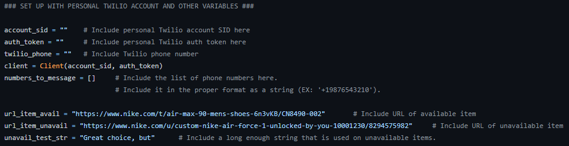
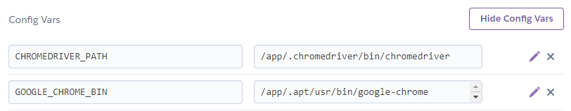
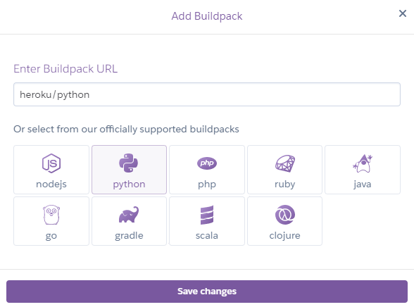
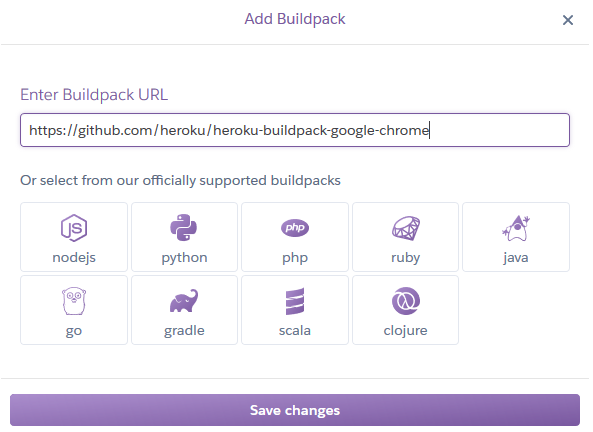
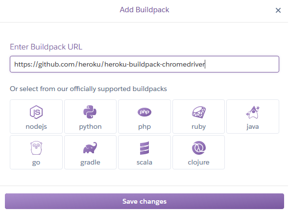
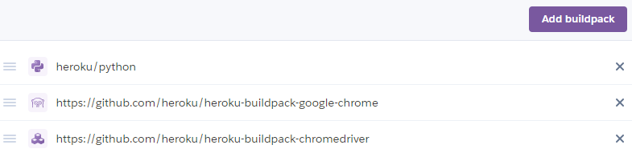
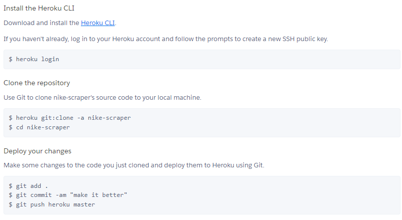

nike-scraper
=====

_Basic webscraper that checks item availability_

Description
-----------

**nike-scraper** uses Twilio, Selenium, and Heroku to constantly check for an
item's online availability.

The basic program was conceived when a friend and I desperately wanted these 
customizable Nike Air Force 1 shoes. Tragically, they were unavailable. In an
era when so many sellers provide a feature for buyers to receive notifications 
whenever an item has been restocked, Nike did not provide - and stil has not
provided - such an option. Thus, during a stale summer break, I created the
following program to assist me.

The code included in this repository is a modified version of the original code.
The new code makes it easy for any user to download and slightly modify the 
Python script to fit their needs.

Usage
-----

_Note: The user must set up a personal Twilio account and fill in any 
corresponding information in the following box of code:

_Also, the user must set up a personal Heroku account._

Create a new app through the Heroku dashboard. Any app name and region choice will
suffice. Afterwards, choose "Create app". The "Add to pipeline..." feature is
neither particularly relevant nor necessary in this case.

The following instructions help set up the Heroku app so that it can properly access
Google Chrome with nike_scraper.py and the Selenium Webdriver.

Continue to the "Settings" tab on your new app profile page. Under
the tab, find the "Config Vars" section, choose "Reveal Config Vars", and add the 
following two Key/Value pairs:

Essentially, the app will find any instance of CHROMEDRIVER_PATH or GOOGLE_CHROME_BIN
that was written in nike_scraper.py and replace it with its corresponding value. For
convenience, I also have the Key/Value pairs included for copying and pasting:

`Key: CHROMEDRIVER_PATH          Value: /app/.chromedriver/bin/chromedriver`
`Key: GOOGLE_CHROME_BIN          Value: /app/.apt/usr/bin/google-chrome`

Next, find the "Buildpacks" section, which should be directly under the "Config
Vars" section. The "Buildpacks" are the scripts that will run after app deployment.
In this case, the included scripts will install Python, Google Chrome, and Chromedriver
(The Google Chrome and Chromedriver downloaded are located by the "Config Vars" keys). 
Choose "Add buildpack", and include three buildpacks: Python (which should conveniently 
be an "officially supported" buildpack that the user can simply click on), Google 
Chrome, and Chromedriver.

I have also included the Github links for the Google Chrome and Chromedriver buildpacks:

`https://github.com/heroku/heroku-buildpack-google-chrome`
`https://github.com/heroku/heroku-buildpack-chromedriver`

When done, the "Buildpack" list should look like the following:

Python, Google Chrome, and Chromedriver are now properly set up!

Next, open the "Deploy" tab, and find the "Deployment method" section. Select "Deploy
using Heroku Git/CLI", and install "Heroku CLI" using the instructions provided. Follow
the instructions provided afterward. I have included the instructions below as well:

_Note: I ran everything here through Windows Terminal_

Finally, have a "dyno" run everything, using the following command in the same project
directory:

`heroku ps:scale worker=1`

Now, the code should be fully running! To turn off the dyno, use the following command:

`heroku ps:scale worker=0`

